# Creating a task in S3

<!-- toc -->

- [Step 0](#step-0)
- [Create buckets for task](#create-buckets-for-task)
- [Uploading your task to S3](#uploading-your-task-to-s3)
- [Update bucket to host task](#update-bucket-to-host-task)
- [Syncing your task to its `task-data-raw` folder](#syncing-your-task-to-its-task-data-raw-folder)
- [Configuring a CloudFront deployment](#configuring-a-cloudfront-deployment)
- [Configuring task web domain on Route 53](#configuring-task-web-domain-on-route-53)
- [Specific task variations](#specific-task-variations)
  * [Sequential Tasks](#sequential-tasks)

<!-- tocstop -->

## Overview

In this guide, we discuss how to create, configure, and upload content to an AWS bucket to host your task website. Imagine a bucket as a sophisticated GitHub or Google Drive folder that gives you the ability to host a website an save data from that website. 

You can find out more about buckets in general on AWS's [documentation](https://docs.aws.amazon.com/AmazonS3/latest/userguide/GetStartedWithS3.html). 

## Step 0

Make sure AWS is configured, which means your account is valid and
working with permissions to create and edit buckets in S3.

## Create buckets for task

1. Log into the AWS Console and navigate to S3. To do this, you can use the search bar to search for s3.
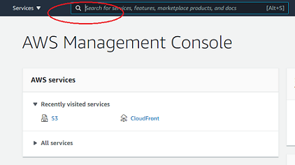

2. For your new task, you’ll ultimately create **2 or 3 buckets**. The goal of three buckets is
to separate data records based on the phase (and thereby reduce confusion). The three buckets are:

    1. `yourtask-yourName-month-year-staging` (optional unless otherwise specified)
		- this stage is for troubleshooting the page itself (NOT collecting data)
		- you don't need this one if your task is simple, like the amplification or sequential tasks that we run
    2. `yourtask-yourName-month-year-pilot`
		- this stage is for testing the task and running the initial batch of participants (usually ~20-30 individuals)
		- if any issues arise in this stage, make sure to change it before you run the "real" production batch
    3. `yourtask-yourName-month-year-production`
		- this stage is for the actual experiment

Example: `amplification-sad-amit-march-21-pilot`
    
3. Now we will make a bucket. Click the **Create bucket.**                                                                    
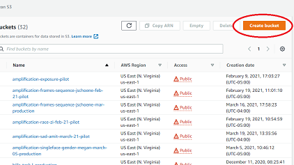

4. Enter your bucket name under **Bucket name**. 

    1. If the settings of your new bucket are similar to the settings of a pre-existing bucket, simply navigate to **Copy settings from existing bucket** and select your bucket-to-copy from there. You may still have to uncheck **Block all public access**, but you are now done.                                                                     
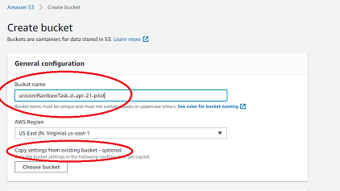

    2. If you are making a new bucket with settings from scratch, proceed with the following. 

		- Select **US East (N. Virginia) us-east-1** as the region.
		- Uncheck the **Block all public access** box. This will prompt a new box to appear, confirming that you want to do this. Check the confirmation box.                          
		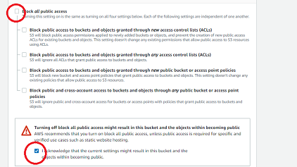
		- Enable bucket versioning by selecting **Enable** under **Bucket Versioning**.                                 
		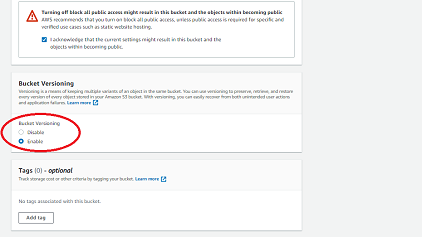

5. Add tags to help differentiate the task:
    1. {Key: **lead-name**, Value: *your-name*}
    2. {Key: **alternate-lead-name**, Value: *another-name*}
    3. {Key: **month**, Value: *month*}
    4. {Key: **yr**, Value: *year*}
    5. {Key: **taskName**, Value: *task-name*}                                                                     

6. Click **Create bucket.** You will return to the bucket menu. 

## Uploading your task to S3


1. On your computer, gather the task materials you will upload to S3. For
example, you may have a structure of files that looks like this:

```bash 
.  
├── external-html/ 
│   └── consent.html 
├── index.html 
├── jspsych/
└── stimuli/ 
  ├── 1.jpg 
  ├── 2.jpg 
  └── 3.jpg 
```

2. Click the **Upload** button, and drag-and-drop all of your files into AWS. 
   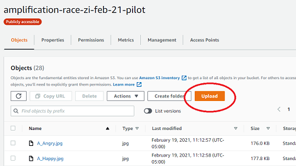
    - IMPORTANT: **if you don't drag and drop, AWS WIll NOT upload your folders.** That means any `img/`, `jspsych/`, etc will not be in the bucket, resulting in a broken website.                                                      
    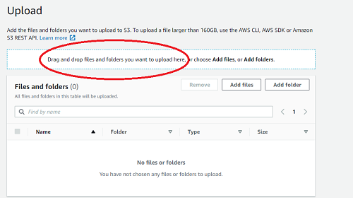
3. Confirm that the files are correct and click **Upload**.

## Update bucket to host task

1. Navigate to the bucket menu. Click on **Properties**.                                    
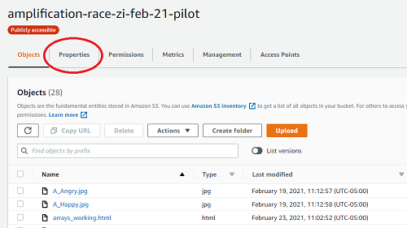
2. Scroll down to the bottom of properties, where you will find **Static website hosting**. Enable it.
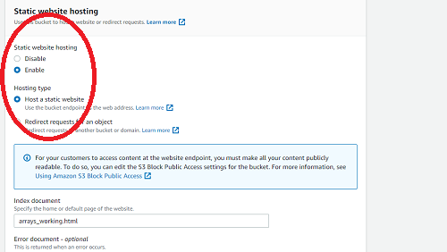
3. It will expand; select **Use this bucket to host a website**.
    1. It will prompt for an **Index document**. Put the `.html` of your main task file here. 
    2. (Optional, but recommended) Add an `error.html` file that AWS will route
       to in case of errors in server-side logic that happen from time to time.
    3. Click **Save**.
    4. The URL of the non-secure website of the task will pop up. You will need this URL later when you set it up to redirect to the secure version of the site

4. Now click on **Permissions**.                                                                        
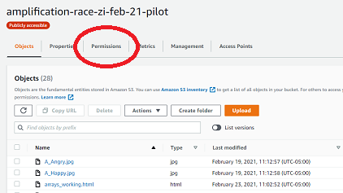

5. Scroll down mid-way until you reach **Bucket Policy**.                                                                                                     
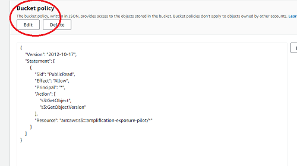
6. A code block editor should appear, and inside of that, paste the following
(note that `name-of-bucket` needs to be replaced by the actual name of your
bucket!) : 

``` 
{ 
  "Version": "2012-10-17", 
  "Statement": [ 
    { 
      "Sid": "PublicRead",
      "Effect": "Allow", 
      "Principal": "*", 
      "Action": [ 
        "s3:GetObject",
        "s3:GetObjectVersion" 
      ], 
      "Resource": "arn:aws:s3:::name-of-bucket/*"
    } 
  ] 
} 
```

7. Click **Save** and follow the prompt to confirm that this should be public.
8. Your bucket is ready to configure with CloudFront.

## Syncing your task to its `task-data-raw` folder

We save to a bucket called `task-data-raw`. So, if the task is called
`potato-production`, we save data to a folder located
within-bucket: `task-data-raw/potato-production`.

To save data from a task, whether it is in staging, pilot, or production, you
must use the [AWS Browser SDK](https://aws.amazon.com/sdk-for-browser/).
There are two ways to use the SDK. The most common way is through a direct script link in the main HTML file:

``` 
<script src="https://sdk.amazonaws.com/js/aws-sdk-2.713.0.min.js"></script>
```

Next, add the saveDataToS3() javascript function to your task as well:

``` 

/*
 * You must use this cognitoIdentityPool string value and 
 * the "task-data-raw" value for DATA_BUCKET. The DIRECTORY value
 * will change based on the task.
 */

const cognitoIdentityPool = "us-east-1:0f699842-4091-432f-8b93-a2d4b7bb5f20";
const DATA_BUCKET = "task-data-raw";
const DIRECTORY = "your-task-bucket-name-with-stage-goes-here";

/*
 * Save data at any point to S3 using this function.
 * It takes as arguments the string identifier of a participant
 * and the data in CSV form from the jsPsych data getter.  
 */ 

function saveDataToS3(id, csv) {

  AWS.config.update({
    region: "us-east-1", 
    credentials: new AWS.CognitoIdentityCredentials({
      IdentityPoolId: cognitoIdentityPool 
    }), 
  });

  // You can change anything after the first `/` here, but only if
  // you know the intended behavior of changing this.
  const filename = `${DIRECTORY}/${id}.csv`;

  const bucket = new AWS.S3({
    params: { Bucket: DATA_BUCKET }, 
    apiVersion: "2006-03-01", 
  })

  const objParams = { 
    Key: filename, 
    Body: csv 
  }

  bucket.putObject(objParams, function(err, data) { 
    if (err) { 
      console.log("Error: ", err.message); 
    } else {
      console.log("Data: ", data); 
    } 
  });


}
```

You will then reference this saving function within `on_finish` or `on_start` tags within
your jsPsych timeline when you would like to save data to S3. Remember to pass
in a participant identifier and the data to be saved in CSV format. This will 
look like:

```
...,
on_finish: function() { 

  const id = "<whatever-the-subject-id-is>"
  const csv = jsPsych.data.get().csv()
  
  saveDataToS3(id, csv)
  
}
...
```

It's _very_ important that you follow this pattern. The `on_finish` or `on_start` piece of jsPsych
structures should use a generic function that _contains_ the `saveDataToS3` function. Do not directly call this function outside of these tags unless you understand what you are doing. 

## Configuring a CloudFront deployment

Now, you must create a CloudFront distribution for the S3 bucket. This will allow us to publish the task securely under the `hbssurvey.com` domain name. 

1. Navigate to the CloudFront service. You can do this by typing "CloudFront" into the search bar.
2. Click **Create Distribution**.                                         
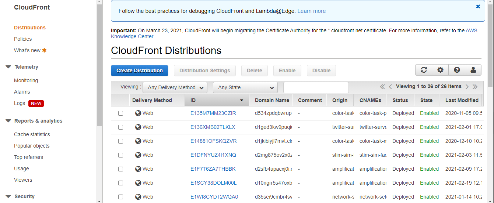
3. Press **Get Started** under the "Web" method of content delivery.                                                  
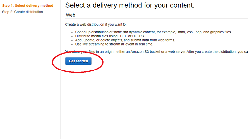
4. Paste the web address of your task's S3 bucket in the field called **Origin Domain Name**. You can find this web address in the bucket page under "Properties" and then "Static Web Hosting." See [Update bucket to host task](#update-bucket-to-host-task) for more info.                                                                                                       
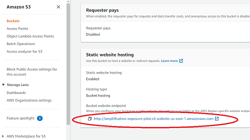
5. Where it asks for **Viewer Protocol Policy**, select **Redirect HTTP to HTTPS**.
6. For the dropdown selector called **Cache Policy**, select **Managed-CachingDisabled**.
7. For the option **Compress Objects Automatically**, select **Yes**.
8. You must make an **Alternate Domain Name (CNAME)** to link it to our lab's study web domain. To do so,
   you will include text describing your task, such as `example-task-name-and-phase.hbssurvey.com`.
    - This is the web address that participants will see when they access the task.
    - If you bucket name is `amplification-sad-amit-march-21-pilot`, a good web address name is `amplification-s-pilot.hbssurvey.com`
    - Be mindful of the names you select and try not to "spoil" participation. For example, a task called `amplification-race-pilot` was changed to `amplification-r-pilot.hbssurvey.com` because we did not want to spoil participants on the fact that this task contained elements related to race. 
9. For **SSL Certificate**, select **Custom SSL Certificate (example.com)**. Then select
   from the dropdown `*.hbssurvey.com (a715bbbd-ad62-49a0-8c75-9fdb9d542633)`
10. Submit by choosing **Create Distribution** again.

Once these steps are completing, AWS will begin deploying the task. Typically, the wait should be less than ten minutes (in extreme cases it can take a few hours). 
Once ready, you'll be able to navigate to your deployed task website.

## Configuring task web domain on Route 53

With a CloudFront deployment of a task, the final step to making it ready for participants
is to create a subdomain on our lab's study domain (e.g., `new-task-name-and-phase.hbssurvey.com`).
You will need your CloudFront deployment's URL to complete this step. You can find the CloudFront URL on the CloudFront home page. The URL will look similar to
`dbmsd35c91.cloudfront.net`.


1. Navigate to the Route 53 service by searching for "Route 53".
2. Click **Hosted zones**, and then click the **hbssurvey.com** domain link in the table.
3. A list in a table called "Records" will appear. Click **Create record**.
4. When prompted to "Choose routing policy", select **Simple routing** and click **Next**.
5. Configure **two** separate records, *A* and *AAAA*. Do the following to create each:
   - Click **Define simple record**.
   - For "Record name", write the subdomain for the task and phase. This should _match exactly_ the
     name you give to the CloudFront distribution `new-task-name-and-phase`.
   - For "Value/Route traffic to", select "Alias to CloudFront distribution". It should automatically
     fill in "US East (N. Virginia)" for the region. Then, "Choose distribution" will provide in a dropdown
     the names of CloudFront distributions that are equipped for the _exact name_ used as a CNAME in the previous
     set of steps. The distribution you should match the CloudFront URL (i.e., `dbmsd35c91.cloudfront.net`).
   - Select for "Record type" either **A** or **AAAA**, or whichever of these two you have not yet done.
6. Finally, click **Create records**.


## Specific task variations

### Calling the `SaveDataToS3` function without passing in arguments (for Sequential and Amplification Tasks)

1. Make sure function `saveDataToS3` is in the `functions.js` file and not the main HTML file.

2. Modify the function so that `id` refers to the global `Face.ID` variable. Now `saveDataToS3` can be called without passing in arguments.

```
function saveDataToS3() {


  id = Face.ID
  csv = jsPsych.data.get().csv()

  AWS.config.update({
    region: "us-east-1", 
    credentials: new AWS.CognitoIdentityCredentials({
      IdentityPoolId: cognitoIdentityPool 
    }), 
  });

  const filename = `${DIRECTORY}/${id}.csv`;

  const bucket = new AWS.S3({
    params: { Bucket: DATA_BUCKET }, 
    apiVersion: "2006-03-01", 
  })

  const objParams = { 
    Key: filename, 
    Body: csv 
  }

  bucket.putObject(objParams, function(err, data) { 
    if (err) { 
      console.log("Error: ", err.message); 
    } else {
      console.log("Data: ", data); 
    } 
  });


} 
```
3. Modify the following variables to contain the `saveDataToS3` function. Not that sometimes the function fails to work with `on_finish` and instead we use `on_start`.

``` 
var imageDescription = {
    type: 'survey-text',
    questions: [{prompt: "Please describe the picture in your own words"}],
    preamble: function() {
      var curr_stim = imageTestDescription.shift()
      return '</img>';
    },
    on_finish: function(data){
      saveDataToS3()
      Face.description = JSON.parse(data.responses).Q0; } //save description
  };


var attentionCheck = { //function for the attention check
    timeline: [askTypeWord],
    loop_function: checkTyping,
    on_start: function(data){
      saveDataToS3()}
  };

  var connectSurvey = {
      type: 'image-button-response',
      stimulus: "",
      choices: ['Begin Survey'],
      on_finish: function(data){
      saveDataToS3()}
  };
  ```

4. Final notes of modifications: make new distinction between EU and US consent, get rid of references to `checkUser` function (temporarily until we construct a new one), change the order of items pushed into `collective_emotion_estimation` timeline

```
var participant_id = { //to check if participants have entered ID (number/character, no punctuation allowed)
    timeline: [enter_id],
    loop_function: checkID,
    // loop_function: checkUser
  };
  
collective_emotion_estimation.push(checkPhone, participant_id, imageDescription);
```
