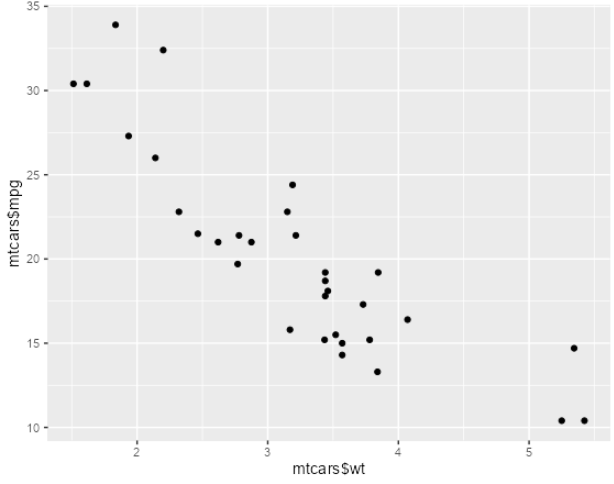

# HBS Grid

The following sections can be used to improve your experience using the
HBS Grid.

<!-- toc -->

- [HBS Grid Connection via RStudio](#hbs-grid-connection-via-rstudio)
  * [Requirements](#requirements)
    + [Local Installation](#local-installation)
    + [SSH Connection via Shell](#ssh-connection-via-shell)
    + [Configure your HBS Grid environment in R](#configure-your-hbs-grid-environment-in-r)
  * [Remote R Instance](#remote-r-instance)
  * [The SSH Tunnel](#the-ssh-tunnel)
  * [Local R instance)](#local-r-instance)
  * [Using RStudio on HBS Grid](#using-rstudio-on-hbs-grid)
  * [`remoter` Package References](#remoter-package-references)

<!-- tocstop -->

## HBS Grid Connection via RStudio

**Everything needs to be done when connected to the HBS VPN.**

There are several methods to work with your local installation of rstudio, using the compute power of the HBS grid. Currently, I (Michael Pinus), think using the `remoter` package is the best method available (without paying for Rstudio Server Pro).

### Requirements

The `remoter` package is required for this guide.

#### Local Installation

In an RStudio console, install the `remoter` package using

```r
R > install.packages("remoter", dependencies=TRUE)
```

#### SSH Connection via Shell

Open a local shell or terminal and SSH into your account. Enter your password if prompted.

```
> ssh rcs_user@hbsgrid.hbs.edu
```

#### Configure your HBS Grid environment in R

Then, you'll need to open an R instance, for this, you'll need to load the R module:

```
> module load R/4.0.2
```

If you want, you can also load additional modules, such as Anaconda. If you do that, you might as well activate your desired conda environment:

```
> module load anaconda/2020.07
> conda activate dlatk
```

Next, get an R instance running with:
```
(dlatk) > R
```

Lastly, install the `remoter` package again, but this time in the HBS Grid environment:

```r
R > install.packages("remoter", dependencies=TRUE)
```

You can now close everything, as the next steps do not assume you have any connections open, or leave everything as-is. 

### Remote R Instance

You should have the package installed both on your local machine and on your R instance in the grid.

To get started with using your local installation of rstudio, using the compute power of the HBS grid, you'll need to have a remote R instance running (and listening), a local R instance running (and send command to the remote instance), and an active ssh tunnel.

We'll start with the remote R instance. Briefly, in your local shell or terminal:

```
> ssh rcs_user@hbsgrid.hbs.edu
> module load R/4.0.2
> module load anaconda/2020.07
> conda activate sp290
(sp290) > R
```

Next, let's make the remote R instance listen for our calls

```r
R > library("remoter")
R > remoter::server()
```

### The SSH Tunnel

Open **an additional** terminal window and create a tunnel, specifying a port redirect from your local 55555 port, to the remote machine's 55555 port. 
  
```
> ssh rcs_user@hbsgrid.hbs.edu  -L 55555:localhost:55555 -N
```
**NOTE:** It will look like the terminal window hanged. You will have no indication that it worked. That's annoying, but you should regulate yourself.

### Local R instance)

Fire up your beautifully-customized rstudio instance, and run the following commands:

```r
R > library("remoter")
R > remoter::client()
```

you should see the console prompt changed to `remoter>`. 
Voilà, each command you send to your local R instance will be redirected to the remote instance. 

### Using RStudio on HBS Grid

The local RStudio environment pane is limited, but workable. 

It will create 'previews' of the objects in the remote environment, with the '_REMOTE' suffix. 
An important `remoter` function to know before we continue is `evalc()` which evaluate an object in the local environment, not the remote environment. 
For instance: 

```r
# while in an R console:
temp <- "Foo!" 
temp # `temp` on remote
# [1] "Foo!" 
evalc(temp_REMOTE) # `temp_REMOTE` on local
# [1] " chr \"Foo!\"" 
```

This will create a remote object `temp`, and a local object `temp_REMOTE`. The remote object is the actual char string "Foo!", and the local object is a description of the remote object, the char string "the char string Foo!".

However, any updates to the remote object will not be reflected in the local object, unless the remote object is deleted and re-created:

```r
# while in an R console:
rm(temp)
temp <- "Foo!"
temp # `temp` on remote
# [1] "Foo!" 
evalc(temp_REMOTE) # `temp_REMOTE` on local
# [1] " chr \"Foo!\"" 

temp <- "Bar!"
temp # `temp` on remote
# [1] "Bar!" 
evalc(temp_REMOTE) # `temp_REMOTE` on local
# [1] " chr \"Foo!\"" 

rm(temp)
temp # `temp` on remote
# Error: object 'temp' not found
evalc(temp_REMOTE) # `temp_REMOTE` on local
# [1] " chr \"Foo!\"" 

temp <- "Bar!"
temp # `temp` on remote
# [1] "Bar!" 
evalc(temp_REMOTE) # `temp_REMOTE` on local
# [1] " chr \"Bar!\"" 
```

Also, this is a preview of the remote object, not the entire remote object. I'll also use now `rmc()` which removes local objects:

```r
# while in an R console:
rm(temp)
rmc(temp_REMOTE)
temp <- list("Foo!", "Bar!")
temp # `temp` on remote
# [[1]]
# [1] "Foo!"
# 
# [[2]]
# [1] "Bar!"
evalc(temp_REMOTE) # `temp_REMOTE` on local
# [1] "List of 2"         " $ : chr \"Foo!\"" " $ : chr \"Bar!\"" 
```

Again, we see the the local object `temp_REMOTE` is a description of the remote object `temp`, and a reflection of it.

If we want the actual remote object in our local environment, e.g., for plotting, we need to transfer it somehow. 
Luckily, we can use `s2c()` and `c2s()` to pass objects between our local environment and the remote environment (server to client, client to server, respectively).

```r
# while in an R console:
library(ggplot2)
p <- qplot(x = mtcars$wt, y = mtcars$mpg)
s2c(p)
evalc(p)
```

This will show this boring (but composed-on-the-grid) graph in your local rsudio plots pane.
We might be able to make this shorter with a helper function someday, but my initial attempts failed.



Yet, this brings about an important issue. When the remote instance encounters some errors (not all), the *connection* will break. 
As this only brings down the connection, not the entire remote R instance, we can reconnect easily, without losing anything.

```r
# while in an R console:
temp <- "Foo!"
temp # `temp` on remote
# [1] "Foo!" 

library(ggplot2)
p <- qplot(x = mtcars$wt, y = mtcars$mpg)

my_plot <- function(x){  # this will be used to cause an error 
    s2c(x)
    evalc(x)
}

my_plot(p) 
# [1] Error in if (get.status(need_auto_rpng_off)) auto_rpng_off_local(get.status(ret)) : argument is of length zero
```

Note the `remoter>` prompt is gone, and we're back to our regular local R instance.
Let's reconnect, and see if `temp` is still there.

```r
# while in an R console:
remoter::client()
temp # `temp` is still on remote
# [1] "Foo!" 
ls()
# [1] "my_plot" "p"       "temp"    "tmp"  # and so are p, and my_plot (and `tmp` created by the remoter package itself).
```
Lastly, there is also the option to pipe commands to the server in batch using the batch() function:
```r
# while in an R console:
# Passing an R script file
remoter::batch(file="my_rscript_file.r")
# Passing in a script manually
remoter::batch(script="1+1")
```

### `remoter` Package References

- [remoter website](https://github.com/RBigData/remoter)
- [remoter user-guide](https://cran.r-project.org/web/packages/remoter/vignettes/remoter.pdf)


